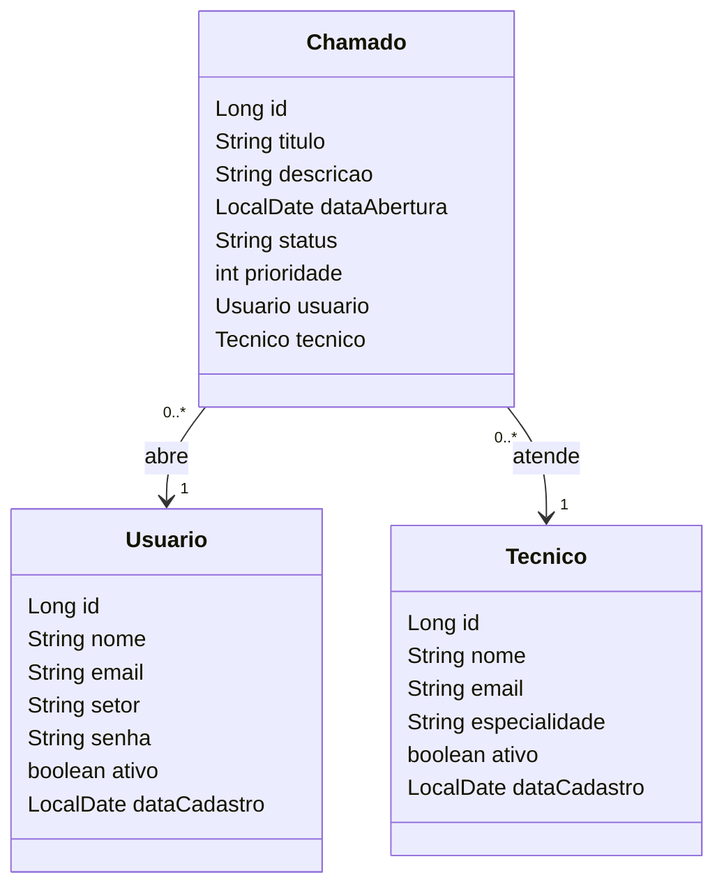

# Sistema de Gerenciamento de Chamados – Backend

Sistema de gerenciamento de chamados de suporte técnico desenvolvido com Spring Boot.  
O projeto tem como objetivo organizar solicitações de suporte, vinculando usuários aos técnicos responsáveis pelo atendimento.

---

## Sobre o Projeto

O Sistema de Gerenciamento de Chamados é uma API REST desenvolvida com o objetivo de organizar e controlar solicitações de suporte técnico.

O sistema permite o cadastro de usuários, técnicos e chamados, possibilitando a associação entre quem abre o chamado e o profissional responsável pelo atendimento.

O projeto foi desenvolvido como atividade acadêmica, aplicando conceitos fundamentais de desenvolvimento backend, arquitetura em camadas, persistência de dados e relacionamento entre entidades.

---

## Tecnologias Utilizadas

- Java 17
- Spring Boot
- Spring Data JPA
- PostgreSQL
- Maven
- Insomnia (testes de API)

---

## Arquitetura

O sistema foi desenvolvido seguindo o padrão arquitetônico em camadas:

- **Controller:** responsável por receber e responder as requisições HTTP
- **Repository:** responsável pela comunicação com o banco de dados
- **Model:** representa as entidades do sistema
- **DTO:** utilizado para transferência de dados entre a API e o cliente

---

## Funcionalidades

### Usuário
- Cadastro de usuários
- Consulta por ID
- Listagem de usuários
- Atualização de dados
- Exclusão de usuários

### Técnico
- Cadastro de técnicos
- Consulta por ID
- Listagem de técnicos
- Atualização de dados
- Exclusão de técnicos

### Chamado
- Cadastro de chamados
- Consulta por ID
- Listagem de chamados
- Atualização de chamados
- Exclusão de chamados
- Associação de chamado com usuário e técnico

---

## Banco de Dados

O sistema utiliza PostgreSQL e é composto pelas seguintes entidades:

- Usuario
- Tecnico
- Chamado

---

## Relacionamentos

- Cada chamado está associado a um usuário
- Cada chamado está associado a um técnico
- Um usuário pode ter vários chamados
- Um técnico pode atender vários chamados

---

## Diagrama de Classes do Sistema



---

## Como Executar o Projeto

### 1. Clonar o projeto

```bash
git clone https://github.com/seu-usuario/sistema-chamados.git
```

### 2. Configurar o banco de dados

No arquivo `application.properties`:

```properties
spring.datasource.url=jdbc:postgresql://localhost:5432/chamados_db
spring.datasource.username=seu_usuario
spring.datasource.password=sua_senha

spring.jpa.hibernate.ddl-auto=update
spring.jpa.show-sql=true
```

### 3. Executar o projeto

```bash
mvn spring-boot:run
```

---

## Endpoints Principais

| Método | Endpoint | Descrição |
|--------|----------|-----------|
| GET | /usuarios | Lista usuários |
| POST | /usuarios | Cria usuário |
| GET | /tecnicos | Lista técnicos |
| POST | /tecnicos | Cria técnico |
| GET | /chamados | Lista chamados |
| POST | /chamados | Cria chamado |

---

## Testes com Insomnia

Exemplos de requisições utilizadas durante os testes:

- Criação de usuário: `POST /usuarios`
- Criação de técnico: `POST /tecnicos`
- Criação de chamado: `POST /chamados`

Também foram realizados testes de:

- Listagem (`GET`)
- Consulta por ID (`GET/{id}`)
- Atualização (`PUT`)
- Exclusão (`DELETE`)

---

## Regras de Negócio

- Todo chamado deve estar vinculado a um usuário
- Todo chamado deve estar vinculado a um técnico
- Não é permitido atualizar ou excluir registros inexistentes
- O status do chamado pode variar entre **Aberto, Em andamento e Fechado**

---

## Conclusão

O desenvolvimento do sistema de gerenciamento de chamados permitiu a aplicação prática dos conceitos estudados na disciplina, como criação de APIs REST, modelagem de entidades e relacionamento entre tabelas.

O sistema foi estruturado de forma simples e organizada, utilizando três entidades principais: Usuário, Técnico e Chamado, sendo o chamado a entidade central do projeto.

A utilização de um DTO facilitou o envio de dados nas requisições, tornando a API mais eficiente e reduzindo erros durante os testes.

Os testes realizados com o Insomnia comprovaram o funcionamento correto das operações de CRUD, bem como a associação entre as entidades.

Dessa forma, o projeto atende aos requisitos propostos e apresenta uma base sólida para possíveis evoluções futuras.

---

## Autor

Projeto desenvolvido por:  
**Adail De Oliveira Santos Stival Teles**  
Estudante de Sistemas de Informação

---

## Status do Projeto

Concluído para fins acadêmicos
